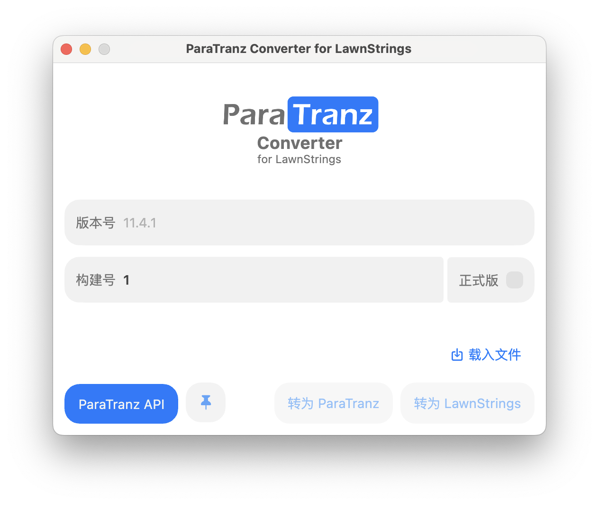

# ParaTranz Converter for LawnStrings

> 一款使用 Kotlin 与 Compose for Desktop 编写的 LawnStrings 与 ParaTranz 格式 JSON 互转的跨平台 GUI 工具。



**支援**

- [x] Windows

- [x] macOS


## 使用方法

### 转换文件

1. 载入文件，Converter 会自动判断文件类型。

   **载入文件**

   1. 直接拖入文件，进行载入。
   2. 单击 **载入文件** 按钮，在弹出的窗口中选择文件。

2. 判断完成后，若 Converter 可以确认载入文件的格式，你只能选择对应的推荐目标格式；若 Converter 无法判断，你仍可以选择其中一个目标格式进行尝试。单击你需要转换的目标文件格式。

   - 转换为 LawnStrings 时，需要指定 **版本号**、 **构建号**，以及是否为 **正式版**。分别会替换掉字符串中的 `{version_full}`、`{build_number}`、`{rel_pre}`，并根据 `{version_full}` 的前两段生成 `{version_main}`，方便对 LawnStrings 对应版本进行管理，并在游戏中展示。

3. 在你期望的目录下进行保存。


### 置顶窗口

> 你可以置顶窗口以更方便地拖入文件。

- 单击  即可置顶窗口；再次单击即可取消置顶。


### ParaTranz API

*UNDER CONSTRUCTION*


## To-do

- [x] 拖拽载入文件
- [x] 置顶窗口
- [ ] 接入 ParaTranz API
  - [x] UI
  - [ ] 实际接入
- [ ] 自动转为 RTON


## Credits

### Smooth Corner Rect Android Compose

This project makes use of the “Smooth Corner Rect Android Compose” library to implement smooth rounded corner rectangles, files are copied as the dependency cannot be imported. This library is developed by Rodrigo Alves and is available under the MIT License.

#### **Library:**

​	• **Name:** Smooth Corner Rect Android Compose

​	• **Author:** Rodrigo Alves

​	• **Repository:** [GitHub - racra/smooth-corner-rect-android-compose](https://github.com/racra/smooth-corner-rect-android-compose)

#### **License:**

```
MIT License

Copyright (c) 2021 Rodrigo Alves

Permission is hereby granted, free of charge, to any person obtaining a copy
of this software and associated documentation files (the "Software"), to deal
in the Software without restriction, including without limitation the rights
to use, copy, modify, merge, publish, distribute, sublicense, and/or sell
copies of the Software, and to permit persons to whom the Software is
furnished to do so, subject to the following conditions:

The above copyright notice and this permission notice shall be included in all
copies or substantial portions of the Software.

THE SOFTWARE IS PROVIDED "AS IS", WITHOUT WARRANTY OF ANY KIND, EXPRESS OR
IMPLIED, INCLUDING BUT NOT LIMITED TO THE WARRANTIES OF MERCHANTABILITY,
FITNESS FOR A PARTICULAR PURPOSE AND NONINFRINGEMENT. IN NO EVENT SHALL THE
AUTHORS OR COPYRIGHT HOLDERS BE LIABLE FOR ANY CLAIM, DAMAGES OR OTHER
LIABILITY, WHETHER IN AN ACTION OF CONTRACT, TORT OR OTHERWISE, ARISING FROM,
OUT OF OR IN CONNECTION WITH THE SOFTWARE OR THE USE OR OTHER DEALINGS IN THE
SOFTWARE.
```
